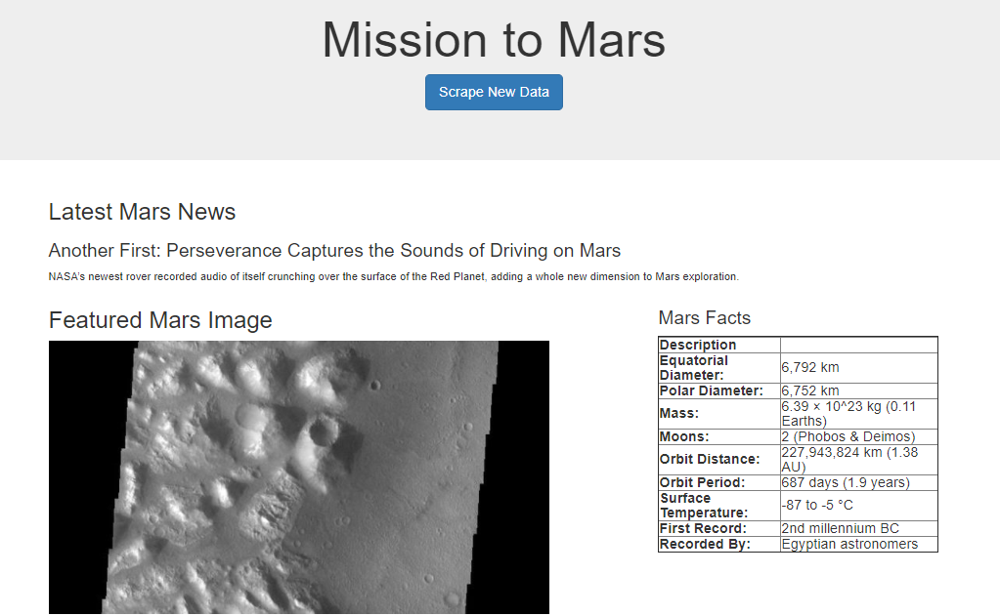
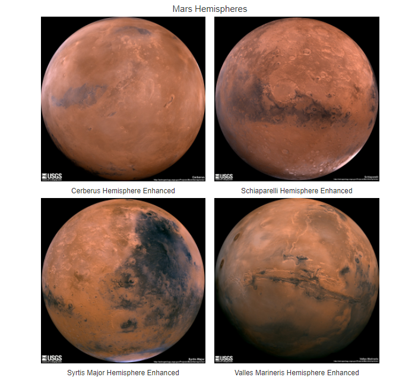

# Web Scraping Homework - Mission to Mars

In this task, I built a web application that scrapes various websites for data related to the Mission to Mars and displays the information in a single HTML page.

## Part 1 - Scraping

I completed the scraping using Jupyter Notebook, BeautifulSoup, Pandas, and Requests/Splinter.

* Created a Jupyter Notebook file called `mission_to_mars.ipynb` and used this to complete all of the scraping and analysis tasks. 

### NASA Mars News

* Scraped the [NASA Mars News Site](https://mars.nasa.gov/news/) and collected the latest News Title and Paragraph Text. I assignes the text to variables that can be referenced later.

### JPL Mars Space Images - Featured Image

* Visited the url for JPL Featured Space Image [here](https://data-class-jpl-space.s3.amazonaws.com/JPL_Space/index.html).

* Used splinter to navigate the site and find the image url for the current Featured Mars Image and assigned the url string to a variable called `featured_image_url`.

### Mars Facts

* Visited the Mars Facts webpage [here](https://space-facts.com/mars/) and used Pandas to scrape the table containing facts about the planet including Diameter, Mass, etc.

* Used Pandas to convert the data to a HTML table string.

### Mars Hemispheres

* Visited the USGS Astrogeology site [here](https://astrogeology.usgs.gov/search/results?q=hemisphere+enhanced&k1=target&v1=Mars) to obtain high resolution images for each of Mar's hemispheres.

* Saved both the image url string for the full resolution hemisphere image, and the Hemisphere title containing the hemisphere name. Used a Python dictionary to store the data using the keys `img_url` and `title`.

* Appended the dictionary with the image url string and the hemisphere title to a list. 

## Part 2 - MongoDB and Flask Application

I used MongoDB with Flask templating to create a new HTML paged that displays the information scraped from the URLs above.

* Converted the Jupyter notebook into a Python script called `scrape_mars.py` with a function called `scrape` that executes all of the scraping code from above and return one Python dictionary containing all of the scraped data.

* Created a route called `/scrape` that imports the `scrape_mars.py` script and call the `scrape` function.

  * Stored the return value in Mongo as a Python dictionary.

* Created a root route `/` that queries the Mongo database and passes the mars data into an HTML template to display the data.

* Created a template HTML file called `index.html` that takes the mars data dictionary and displays all of the data in the appropriate HTML elements.

